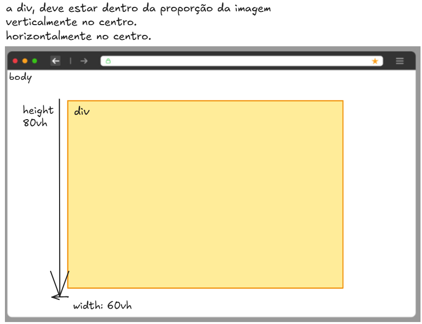

# 🧠 Desafio de CSS – Centralizando com Flexbox

**Data:** 06/05/2025  
**Nível:** Iniciante  
**Tema:** `display: flex`, `align-items`, `justify-content`, `vh`, `gap`, `margin`

---

## 🎯 OBJETIVO:

Reproduzir exatamente o que está na imagem abaixo:

📸 **Descrição da imagem:**



- Uma página da web com fundo branco.
- Dentro do `<body>`, há uma `div` amarela.
- A `div` tem:
  - `height: 80vh` (80% da altura da tela)
  - `width: 60vh`
- A `div` está **centralizada na tela**:
  - **verticalmente no centro**
  - **horizontalmente no centro**

---

## 🧩 INSTRUÇÕES

1. Crie um arquivo HTML com o nome `index.html`.
2. Crie um arquivo CSS com o nome `style.css`.
3. No HTML, crie a estrutura básica:
```html
<!DOCTYPE html>
<html lang="pt-br">
<head>
  <meta charset="UTF-8">
  <title>Desafio Flex</title>
  <link rel="stylesheet" href="style.css">
</head>
<body>
  <div class="caixa"></div>
</body>
</html>
```

4. No CSS, você vai:
   - Aplicar `display: flex` no `body`
   - Usar `justify-content` e `align-items` para centralizar a `div`
   - Aplicar tamanho fixo com `vh` para altura e largura da `div`
   - Adicionar uma cor de fundo e borda visível

---

## 💡 DICA:

Use esse esqueleto:

```css
body {
  height: 100vh;
  display: flex;
  justify-content: center;  /* Alinha no centro horizontal */
  align-items: center;      /* Alinha no centro vertical */
  background-color: white;
}

.caixa {
  height: 80vh;
  width: 60vh;
  background-color: #ffef99;
  border: 2px solid orange;
}
```

---

## ✅ O QUE VOU AVALIAR

- A `div` está centralizada corretamente?
- As medidas estão em `vh` como na imagem?
- Foi usado `display: flex` corretamente?
- Está organizado com CSS separado?

---

## 🔄 BÔNUS

Se sobrar um tempinho, tente:

- Adicionar `gap`, `margin`, ou `padding` para testar diferenças.
- Alterar o `flex-direction` e observar o que muda.

---

📝 **Lembre-se:** HTML monta a estrutura, e CSS é quem deixa tudo bonito e no lugar certo!

