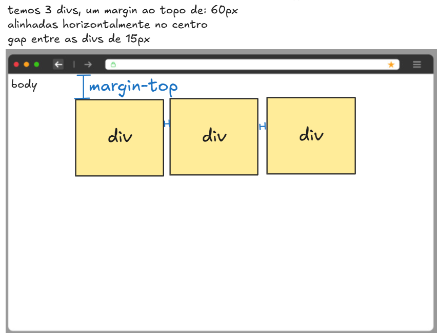

# 🧠 Desafio de CSS – Três DIVs Alinhadas com Espaçamento

**Data:** 06/05/2025  
**Nível:** Iniciante  
**Tema:** `display: flex`, `justify-content`, `gap`, `margin-top`

---

## 🎯 OBJETIVO:

Reproduzir exatamente o que está representado na imagem:

📸 **Descrição da imagem:**



- Temos **três `divs` amarelas** lado a lado, centralizadas na horizontal.
- Elas estão um pouco afastadas do topo da página.
- Cada `div` tem:
  - **margin-top de 60px**
  - **espaçamento (gap) de 15px entre elas**
- Todas estão **dentro do body**, centralizadas horizontalmente.

---

## 🧩 INSTRUÇÕES

1. Crie um arquivo `index.html`
2. Crie um arquivo `style.css`
3. Escreva a estrutura HTML:

```html
<!DOCTYPE html>
<html lang="pt-br">
<head>
  <meta charset="UTF-8">
  <title>Desafio das 3 DIVs</title>
  <link rel="stylesheet" href="style.css">
</head>
<body>
  <div class="container">
    <div class="caixa"></div>
    <div class="caixa"></div>
    <div class="caixa"></div>
  </div>
</body>
</html>
```

---

## 🎨 CSS Esperado:

```css
body {
  margin: 0;
}

.container {
  display: flex;
  justify-content: center;   /* Alinha no centro horizontal */
  gap: 15px;                 /* Espaço entre as caixas */
  margin-top: 60px;          /* Distância do topo */
}

.caixa {
  width: 120px;
  height: 120px;
  background-color: #ffef99;
  border: 2px solid black;
}
```

---

## ✅ O QUE VOU AVALIAR

- As `divs` estão centralizadas horizontalmente?
- Há `60px` de espaço do topo da página?
- O `gap` entre elas está funcionando?
- Está tudo bem organizado no HTML e CSS?

---

## 🔄 DESAFIO EXTRA

Tente mudar a quantidade de `divs` ou usar `flex-wrap` para ver como o layout se adapta.

---

📝 **Resumo das propriedades usadas:**

| Propriedade       | Função                                      |
|-------------------|----------------------------------------------|
| `display: flex`   | Ativa o modo flexível para alinhar elementos |
| `justify-content` | Alinha na horizontal                         |
| `gap`             | Define o espaço entre os elementos           |
| `margin-top`      | Empurra o conteúdo para baixo                |

---

Parabéns por praticar CSS! Continuar praticando é o segredo para dominar estilos! 💪

