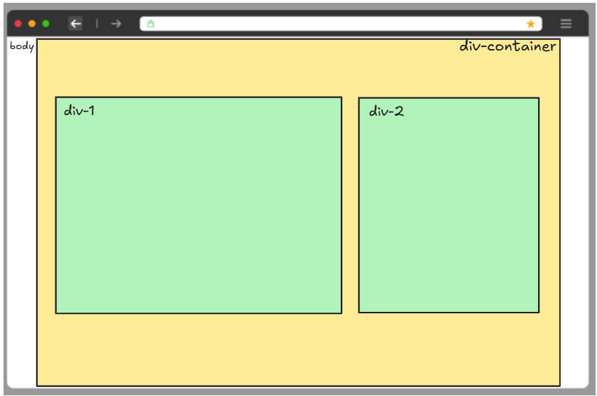

# 🧠 Desafio de CSS – Container com Altura e Largura Proporcional + DIVs Centradas

**Data:** 06/05/2025  
**Nível:** Iniciante a Intermediário  
**Tema:** `display: flex`, `justify-content`, `align-items`, `vh`, `% de largura`, centralização

---

## 🎯 OBJETIVO:

Reproduzir o layout da imagem com as proporções e centralizações exatas:

📸 **Descrição da estrutura:**


- O `body` é o fundo branco da página.
- Dentro do `body`, temos uma `div-container` com:
  - **altura: 100vh**
  - **largura: 80%**
  - **centralizada horizontalmente no body**

- Dentro da `div-container`, temos:
  - duas `divs`:
    - `.div-1`: largura de 60%, altura de 50vh
    - `.div-2`: largura de 40%, altura de 50vh
  - ambas estão:
    - **centralizadas verticalmente e horizontalmente** dentro do container

---

## 🧩 INSTRUÇÕES

1. Crie um arquivo `index.html`
2. Crie um arquivo `style.css`
3. Estrutura base do HTML:

```html
<!DOCTYPE html>
<html lang="pt-br">
<head>
  <meta charset="UTF-8">
  <title>Desafio Container</title>
  <link rel="stylesheet" href="style.css">
</head>
<body>
  <div class="container">
    <div class="div-1">div-1</div>
    <div class="div-2">div-2</div>
  </div>
</body>
</html>
```

---

## 🎨 CSS SUGERIDO

```css
body {
  margin: 0;
  background-color: white;
  display: flex;
  justify-content: center;
}

.container {
  width: 80%;
  height: 100vh;
  background-color: #ffef99;
  display: flex;
  justify-content: center;
  align-items: center;
  gap: 20px;
}

.div-1,
.div-2 {
  height: 50vh;
  background-color: #b2f2bb;
  border: 1px solid black;
}

.div-1 {
  width: 60%;
}

.div-2 {
  width: 40%;
}
```

---

## ✅ O QUE VOU AVALIAR

- A `container` está com 80% de largura e centralizada no body?
- As duas divs estão **dentro** do container?
- As larguras estão proporcionais (60% e 40%)?
- A altura está correta (50vh)?
- As divs estão **centralizadas** dentro da `container`?

---

## 🔄 EXTRA

Tente alterar o `flex-direction` do container para ver o que acontece.  
Experimente ajustar o `gap`, `padding`, ou adicionar mais divs.

---

📝 **Resumo prático:**

| Elemento       | Propriedade            | Valor          |
|----------------|------------------------|----------------|
| `.container`   | `width`                | 80%            |
| `.container`   | `height`               | 100vh          |
| `.container`   | `display`              | flex           |
| `.container`   | `justify-content`      | center         |
| `.container`   | `align-items`          | center         |
| `.div-1`       | `width`                | 60%            |
| `.div-2`       | `width`                | 40%            |
| `.div-1/2`     | `height`               | 50vh           |

---

Continue praticando para dominar o posicionamento de elementos com Flexbox! 💪

